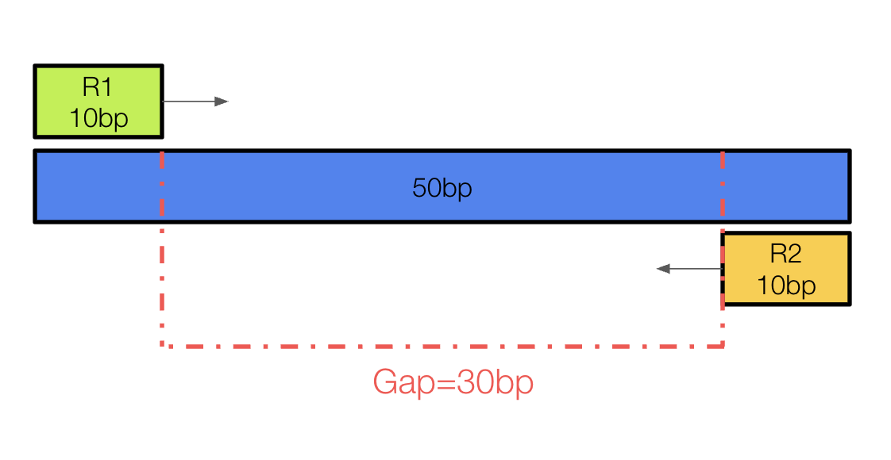

# Align 
https://hbctraining.github.io/Intro-to-ChIPseq-flipped/lessons/04_alignment_using_bowtie2.html

```bash
bowtie2 -p threads \ 
	--very-sensitive-local \
	--local -N 0 \
	--phred33 \ 
	-x $ref_filepath \
	--rg-id sample_ID_tag \
	--rg SM:sample_ID_tag \
	-1 R1.fastq \
	-2 R2.fastq \
	-S output.sam \
	>& output.log
```
**-p** : If your computer has multiple processors/cores specify the number; the default=1. Use 4 per sample.
**--very-sensitive -local**: Same as -D 20 -R 3 -N 0 -L 20 -i S,1,0.50
**--local**: characters may be omitted ("soft clipped") from the ends to achieve the greatest possible alignment score.
**--N**: Sets the number of mismatches to allowed in a seed alignment during multiseed alignment. Default=0, increasing it slows down the alignment but increases sensitivity. 
**--phred33**: Input qualities are ASCII chars equal to the Phred+33 encoding (used by Illumina pipelines).
**-x**: Filepath to the indexed reference genome
**--rg-id**: This causes the SAM @RG header line to be printed, with <text> as the value associated with the ID: tag
**--rg SM:**: Add <text> as a field on the @RG header line. In order for the @RG line to appear, --rg-id must be specified.
**-1**: file containing mate 1 reads
**-2**: file containing mate 2 reads
**-U**: comma-separated list of files containing unpaired reads to be aligned 
**-S**: the output alignment in SAM format. 
**>&**: the pathway for where to store log output for the alignment 
**-X**: The maximum gap length for valid paired-end alignments.
For example in -X 20, if the gap between R1 and R2 exceeds 20, those alignments are not valid. If the gap between R1 and R2 is less than 20, that's acceptable. 

This alignment would be invalid because the gap is at 30 and exceeds -X 20.

```bash
nano $scripts/rhino_align_part_001.bash
#!/bin/bash
#SBATCH --nodes=1
#SBATCH --ntasks=4
#SBATCH --mem=30GB
#SBATCH --time=8:00:00
#SBATCH --account=zps5164_sc_default
#SBATCH --job-name=rhino_align_part_001
#SBATCH --error=/storage/group/zps5164/default/shared/rhinos/err/%x.%j.out

#Set Variables
scripts="/storage/group/zps5164/default/shared/rhinos/scripts"
ref="/storage/group/zps5164/default/shared/reference_genomes/black_rhino"
fastq="/storage/group/zps5164/default/shared/rhinos/fastq"
bowtie="/storage/home/abc6435/ToewsLab/bin/bowtie2-2.3.5.1"
sam="/storage/group/zps5164/default/shared/rhinos/sam"
err="/storage/group/zps5164/default/shared/rhinos/err"

#Index Ref
# cd $ref
# gunzip -c Diceros_bicornis_HiC.fasta.gz > Diceros_bicornis_HiC.fasta
# $bowtie/bowtie2-build Diceros_bicornis_HiC.fasta Diceros_bicornis_HiC

$bowtie/bowtie2 -p 4 --very-sensitive-local --local -N 0 --phred33 \
    -x $ref/Diceros_bicornis_HiC \
    --rg-id BR18 --rg SM:BR18 -X 700 \
    -1 $fastq/split/BR18_trim.pair1.part_001.truncated.gz \
    -2 $fastq/split/BR18_trim.pair2.part_001.truncated.gz \
    -U $fastq/split/BR18_trim.part_001.collapsed.gz \
    -S $sam/BR18_part_001.sam \
    2> $err/BR18_part_001.bowtie.log 
```

