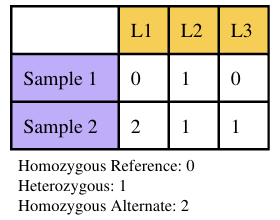

## Filter VCF
Final SNP#: 19,961

```bash
#Set Variables
scripts_folder="/storage/home/abc6435/SzpiechLab/abc6435/KROH/scripts"
nano $scripts_folder/filter_vcf_rldne.bash
#!/bin/bash
#SBATCH --nodes=1
#SBATCH --ntasks=1
#SBATCH --mem=10GB
#SBATCH --time=08:00:00
#SBATCH --account=open
#SBATCH --job-name=filter_vcf_rldne
#SBATCH --error=/storage/home/abc6435/SzpiechLab/abc6435/KROH/job_err_output/%x.%j.out

#Set Variables
scripts_folder="/storage/home/abc6435/SzpiechLab/abc6435/KROH/scripts"
vcf_folder="/storage/home/abc6435/SzpiechLab/abc6435/KROH/data/vcf"
work_dir="/storage/home/abc6435/SzpiechLab/abc6435/KROH/data/rldne"

#Samples: Include only hKIWA
bcftools view \
    -S $scripts_folder/hKIWA_IDS.txt \
    $vcf_folder/chKIWA_AMRE_HOWA_tags_auto_bi.vcf.gz \
    -Oz -o $work_dir/hKIWA_tags_auto_bi.vcf.gz

#Genotype: Read Depth and Genotype Quality
bcftools filter \
    -e 'FORMAT/DP < 6 || FORMAT/GQ < 20' \
    --set-GTs . \
    $work_dir/hKIWA_tags_auto_bi.vcf.gz \
    -Oz -o $work_dir/hKIWA_tags_auto_bi_gtdp_gtgq.vcf.gz

#Genotype: Missing (RLDNe can't handle missing data)
bcftools view -i \
    'N_MISSING=0' \
    $work_dir/hKIWA_tags_auto_bi_gtdp_gtgq.vcf.gz \
    -Oz -o $work_dir/hKIWA_tags_auto_bi_gtdp_gtgq_nmiss.vcf.gz
```

## Modify Data
RLDe expects the data to be in a specific format. 


```bash
#Set Variables
scripts_folder="/storage/home/abc6435/SzpiechLab/abc6435/KROH/scripts"
vcf_folder="/storage/home/abc6435/SzpiechLab/abc6435/KROH/data/vcf"
work_dir="/storage/home/abc6435/SzpiechLab/abc6435/KROH/data/rldne"

echo "CHROM  POS   29779 383194  383202  383205  507264  507265" >> $work_dir/hKIWA_rldne.vcf

bcftools query -f '%CHROM\t%POS\t[%GT\t]' $work_dir/hKIWA_tags_auto_bi_gtdp_gtgq_nmiss.vcf.gz >> $work_dir/hKIWA_rldne.vcf

awk '{print $0, $9=$1"_"$2}' OFS='\t' $work_dir/hKIWA_rldne.vcf  >> $work_dir/temp && mv -f $work_dir/temp $work_dir/hKIWA_rldne.vcf
```