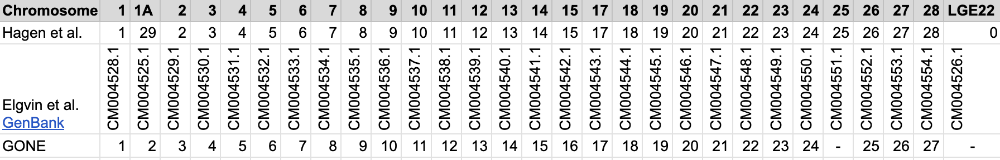

# Obtain a Recombination Map
In the issues page, Armando stresses the importance of a good recombination map. I obtained a recombination map from Hagen et al. 2019. (https://datadryad.org/dataset/doi:10.5061/dryad.00000000n)

## Download the recombination map from the dryad db
```bash
cd /storage/home/abc6435/SzpiechLab/abc6435/KROH/data/hosp_ref
wget -O hosp.map https://datadryad.org/downloads/file_stream/221628
```

## Interpolate positions for all chromosomes
The recombination map has cMMb infromation for only a few hundred markers per chromosome. Using an rscript I already made, I will interpolate the cMMb for all positions between the markers. 

## Download R Packages 
These need to be installed before running the interpolation_map.R script
```bash
## Load R Module and Install Packages
module use /storage/icds/RISE/sw8/modules/r 
module load r/4.2.1-gcc-8.5.0

Rscript -e "options(repos = c(CRAN = 'https://cloud.r-project.org')); install.packages('dplyr', lib='/storage/group/zps5164/default/bin/.R')"

Rscript -e "options(repos = c(CRAN = 'https://cloud.r-project.org')); install.packages('zoo', lib='/storage/group/zps5164/default/bin/.R')"
```

## Run interpolation_map.R 
```bash
nano $hosp_ref/interpolate_map.bash
#!/bin/bash
#SBATCH --nodes=1
#SBATCH --ntasks=1
#SBATCH --mem=50G
#SBATCH --time=48:00:00
#SBATCH --account=dut374_c
#SBATCH --job-name=interpolate_map

#Set Variables
hosp_ref="/storage/home/abc6435/SzpiechLab/abc6435/KROH/data/hosp_ref"

$hosp_ref/interpolate_map.R $hosp_ref/hosp.map 0 467554 /storage/home/abc6435/SzpiechLab/abc6435/KROH/data/hosp_ref /storage/group/zps5164/default/bin/.R

$hosp_ref/interpolate_map.R $hosp_ref/hosp.map 1 112674304 /storage/home/abc6435/SzpiechLab/abc6435/KROH/data/hosp_ref /storage/group/zps5164/default/bin/.R

$hosp_ref/interpolate_map.R $hosp_ref/hosp.map 2 147836772 /storage/home/abc6435/SzpiechLab/abc6435/KROH/data/hosp_ref /storage/group/zps5164/default/bin/.R

$hosp_ref/interpolate_map.R $hosp_ref/hosp.map 3 110987800 /storage/home/abc6435/SzpiechLab/abc6435/KROH/data/hosp_ref /storage/group/zps5164/default/bin/.R

$hosp_ref/interpolate_map.R $hosp_ref/hosp.map 4 70348008 /storage/home/abc6435/SzpiechLab/abc6435/KROH/data/hosp_ref /storage/group/zps5164/default/bin/.R

$hosp_ref/interpolate_map.R $hosp_ref/hosp.map 5 61081188 /storage/home/abc6435/SzpiechLab/abc6435/KROH/data/hosp_ref /storage/group/zps5164/default/bin/.R

$hosp_ref/interpolate_map.R $hosp_ref/hosp.map 6 35007241 /storage/home/abc6435/SzpiechLab/abc6435/KROH/data/hosp_ref /storage/group/zps5164/default/bin/.R

$hosp_ref/interpolate_map.R $hosp_ref/hosp.map 7 36521674 /storage/home/abc6435/SzpiechLab/abc6435/KROH/data/hosp_ref /storage/group/zps5164/default/bin/.R

$hosp_ref/interpolate_map.R $hosp_ref/hosp.map 8 49693984 /storage/home/abc6435/SzpiechLab/abc6435/KROH/data/hosp_ref /storage/group/zps5164/default/bin/.R

$hosp_ref/interpolate_map.R $hosp_ref/hosp.map 9 25224909 /storage/home/abc6435/SzpiechLab/abc6435/KROH/data/hosp_ref /storage/group/zps5164/default/bin/.R

$hosp_ref/interpolate_map.R $hosp_ref/hosp.map 10 21077231 /storage/home/abc6435/SzpiechLab/abc6435/KROH/data/hosp_ref /storage/group/zps5164/default/bin/.R

$hosp_ref/interpolate_map.R $hosp_ref/hosp.map 11 20431416 /storage/home/abc6435/SzpiechLab/abc6435/KROH/data/hosp_ref /storage/group/zps5164/default/bin/.R

$hosp_ref/interpolate_map.R $hosp_ref/hosp.map 12 19787094 /storage/home/abc6435/SzpiechLab/abc6435/KROH/data/hosp_ref /storage/group/zps5164/default/bin/.R

$hosp_ref/interpolate_map.R $hosp_ref/hosp.map 13 18021457 /storage/home/abc6435/SzpiechLab/abc6435/KROH/data/hosp_ref /storage/group/zps5164/default/bin/.R

$hosp_ref/interpolate_map.R $hosp_ref/hosp.map 14 16467355 /storage/home/abc6435/SzpiechLab/abc6435/KROH/data/hosp_ref /storage/group/zps5164/default/bin/.R

$hosp_ref/interpolate_map.R $hosp_ref/hosp.map 15 14042894 /storage/home/abc6435/SzpiechLab/abc6435/KROH/data/hosp_ref /storage/group/zps5164/default/bin/.R

$hosp_ref/interpolate_map.R $hosp_ref/hosp.map 17 11241730 /storage/home/abc6435/SzpiechLab/abc6435/KROH/data/hosp_ref /storage/group/zps5164/default/bin/.R

$hosp_ref/interpolate_map.R $hosp_ref/hosp.map 18 11529515 /storage/home/abc6435/SzpiechLab/abc6435/KROH/data/hosp_ref /storage/group/zps5164/default/bin/.R

$hosp_ref/interpolate_map.R $hosp_ref/hosp.map 19 11116859 /storage/home/abc6435/SzpiechLab/abc6435/KROH/data/hosp_ref /storage/group/zps5164/default/bin/.R

$hosp_ref/interpolate_map.R $hosp_ref/hosp.map 20 14776391 /storage/home/abc6435/SzpiechLab/abc6435/KROH/data/hosp_ref /storage/group/zps5164/default/bin/.R

$hosp_ref/interpolate_map.R $hosp_ref/hosp.map 21 5712519 /storage/home/abc6435/SzpiechLab/abc6435/KROH/data/hosp_ref /storage/group/zps5164/default/bin/.R

$hosp_ref/interpolate_map.R $hosp_ref/hosp.map 22 3666047 /storage/home/abc6435/SzpiechLab/abc6435/KROH/data/hosp_ref /storage/group/zps5164/default/bin/.R

$hosp_ref/interpolate_map.R $hosp_ref/hosp.map 23 7033470 /storage/home/abc6435/SzpiechLab/abc6435/KROH/data/hosp_ref /storage/group/zps5164/default/bin/.R

$hosp_ref/interpolate_map.R $hosp_ref/hosp.map 24 7077728 /storage/home/abc6435/SzpiechLab/abc6435/KROH/data/hosp_ref /storage/group/zps5164/default/bin/.R

$hosp_ref/interpolate_map.R $hosp_ref/hosp.map 25 476507 /storage/home/abc6435/SzpiechLab/abc6435/KROH/data/hosp_ref /storage/group/zps5164/default/bin/.R

$hosp_ref/interpolate_map.R $hosp_ref/hosp.map 26 6896631 /storage/home/abc6435/SzpiechLab/abc6435/KROH/data/hosp_ref /storage/group/zps5164/default/bin/.R

$hosp_ref/interpolate_map.R $hosp_ref/hosp.map 27 3737950 /storage/home/abc6435/SzpiechLab/abc6435/KROH/data/hosp_ref /storage/group/zps5164/default/bin/.R

$hosp_ref/interpolate_map.R $hosp_ref/hosp.map 28 3534834 /storage/home/abc6435/SzpiechLab/abc6435/KROH/data/hosp_ref /storage/group/zps5164/default/bin/.R

$hosp_ref/interpolate_map.R $hosp_ref/hosp.map 29 69873230 /storage/home/abc6435/SzpiechLab/abc6435/KROH/data/hosp_ref /storage/group/zps5164/default/bin/.R
```

## Subset Interpolated Maps to Variant Sites
This will increase computation efficiency
```bash
#Set Variables
work_dir="/storage/home/abc6435/SzpiechLab/abc6435/KROH/data/gone/vcf_kirt"
hosp_ref="/storage/home/abc6435/SzpiechLab/abc6435/KROH/data/hosp_ref"
chr_list=($(cut -f2 $work_dir/chrs_hagen.txt))

for i in "${chr_list[@]}"; do
    plink --vcf $work_dir/${i}.vcf.gz --recode --chr-set 29 --make-bed --out $hosp_ref/${i};
done

#Remove any unnessary files
cd $hosp_ref
rm -rf *.nosex *.log *.fam *.bed *.bim *.ped

#Create keys for map files
for i in "${chr_list[@]}"; do
    awk 'BEGIN {OFS="\t"} {print $0, $1"_"$4}' ${i}.map > temp && mv -f temp ${i}.map
    awk 'BEGIN {OFS="\t"} {print $0, $1"_"$4}' ${i}int.map > temp && mv -f temp ${i}int.map;
done
```

## Merge Maps via Key
```bash
for i in "${chr_list[@]}"; do
    awk 'NR==FNR{a[$5]=$3; next} $5 in a {print $1, $2, a[$5], $4}' ${i}int.map ${i}.map > ${i}_gone.map; 
done

for i in "${chr_list[@]}"; do
    sed -i 's/ /\t/g' ${i}_gone.map; 
done
```

## Concatenate Map Files
I will also change the chromosome names so that they satisfy the GONE naming scheme requirement. 


```bash
work_dir="/storage/home/abc6435/SzpiechLab/abc6435/KROH/data/gone/vcf_kirt"
hosp_ref="/storage/home/abc6435/SzpiechLab/abc6435/KROH/data/hosp_ref"
chr_list=($(cut -f2 $work_dir/chrs_hagen.txt))


for i in "${chr_list[@]}"; do
    cat ${i}_gone.map >> gone.map; 
done

#give it a key
awk 'BEGIN {OFS="\t"} {print $0, $1"_"$4}' gone.map > temp && mv -f temp gone.map

mv gone.map ~/SzpiechLab/abc6435/KROH/data/gone
```