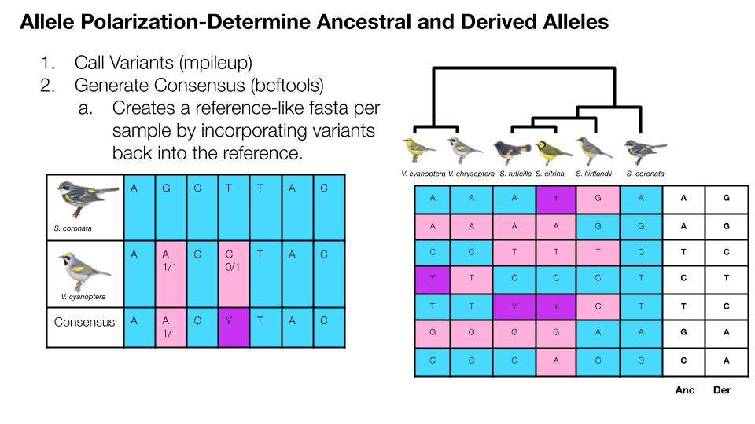

## Consensus Sequences
A consensus sequence represents the most common nucleotide or amino acid at each position within a multiple sequence alignment of related sequences. Here, I'm generating concensus sequences to then determine ancestral vs derived alleles.



## Run mpileup
```bash
scripts="/storage/home/abc6435/SzpiechLab/abc6435/KROH/scripts"

#Create sample file
cat $scripts/HOWA_AMRE_cKIWA_IDS.txt $scripts/GWBW_IDS.txt >> $work/SAM_IDS.txt

#Scripts
for i in `cat $work/SAM_IDS.txt`; do
    cat <<EOT > $scripts/concensus_${i}.bash
#!/bin/bash
#SBATCH --nodes=1
#SBATCH --ntasks=1
#SBATCH --mem=10GB
#SBATCH --time=6:00:00
#SBATCH --account=open
#SBATCH --job-name=concensus_${i}
#SBATCH --output=/storage/home/abc6435/SzpiechLab/abc6435/KROH/job_err_output/%x.%j.log

#Set Variables
ref="/storage/home/abc6435/SzpiechLab/abc6435/KROH/data/mywa_ref/mywa_reference/mywagenomev2.1.fa"
work="/storage/home/abc6435/SzpiechLab/abc6435/KROH/data/polar"
bam="/storage/home/abc6435/SzpiechLab/abc6435/KROH/data/bam"

bcftools mpileup -Ou -f \$ref \$bam/1940_marked.bam | \\
  bcftools call -Ou -mv | \\
  bcftools norm -Ou -f \$ref | \\
  bcftools view -Oz -o \$work/${i}.unfiltered.vcf.gz

bcftools filter -s LowQual -e '%QUAL<20 || %DP<10' \\
    \$work/${i}.unfiltered.vcf.gz \\
    -Oz -o \$work/${i}.vcf.gz 

bcftools consensus \\
    -f \$ref \\
    \$work/${i}.vcf.gz \\
    > \$work/${i}.fa
EOT
done

#Submit
for i in `cat $work/SAM_IDS.txt`; do
    sbatch $scripts/concensus_${i}.bash;
done
