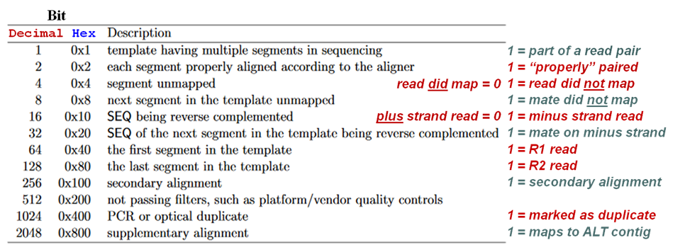

# Prepare BAMS

## QC Filtering 

```bash
nano $scripts/rohan_qc.bash
#!/bin/bash
#SBATCH --nodes=1
#SBATCH --mem=10GB
#SBATCH --time=24:00:00
#SBATCH --account=dut374_sc_default
#SBATCH --job-name=rohan_qc
#SBATCH --error=/storage/home/abc6435/SzpiechLab/abc6435/KROH/err/%x.%j.out

#Set Variables
scripts="/storage/home/abc6435/SzpiechLab/abc6435/KROH/scripts"
bam="/storage/home/abc6435/SzpiechLab/abc6435/KROH/data/bam"

for i in $(cat $scripts/KIWA_IDS_e759877.txt); do
    samtools view -b -F 0x200 $bam/${i}_sorted_marked.rescaled.bam \
    | samtools sort -o $bam/${i}_sorted_marked_rescaled_qc.bam 
    samtools index $bam/${i}_sorted_marked_rescaled_qc.bam;
done
```

## bam2prof
Scans aligned reads and computes nucleotide substitition near the 5' and 3' ends to detect post-mortem DNA damage which is a characterisitc of aDNA
```bash

for i in `cat $scripts/KIWA_IDS_e759877.txt`; do 
    cat <<EOT > $scripts/bam2prof_${i}.bash
#!/bin/bash
#SBATCH --nodes=1
#SBATCH --ntasks=1
#SBATCH --mem=5GB
#SBATCH --time=2:00:00
#SBATCH --account=open
#SBATCH --job-name=bam2prof_${i}
#SBATCH --error=/storage/home/abc6435/SzpiechLab/abc6435/KROH/err/%x.%j.out

#Set Variables
bam2prof="/storage/home/abc6435/SzpiechLab/bin/rohan/bam2prof"
bam="/storage/home/abc6435/SzpiechLab/abc6435/KROH/data/bam"
work="/storage/home/abc6435/SzpiechLab/abc6435/KROH/data/rohan"

#load GSL
module load gsl
module use gsl

#Run bam2prof
\$bam2prof/bam2prof \\
    -double \\
    -paired \\
    -classic \\
    -5p \$work/${i}_5p.prof \\
    -3p \$work/${i}_3p.prof \\
    -o \$work \\
    \$bam/${i}_sorted_marked_rescaled_qc.bam
EOT
done

# Change .prof file names
for i in $(cat $scripts/KIWA_IDS_e759877.txt); do
    mv ${i}_sorted_marked_rescaled_qc_classic_*_3p.prof ${i}_3p.prof;
done


for i in $(cat $scripts/KIWA_IDS_e759877.txt); do
    mv ${i}_sorted_marked_rescaled_qc_classic_*_5p.prof ${i}_5p.prof;
done
```