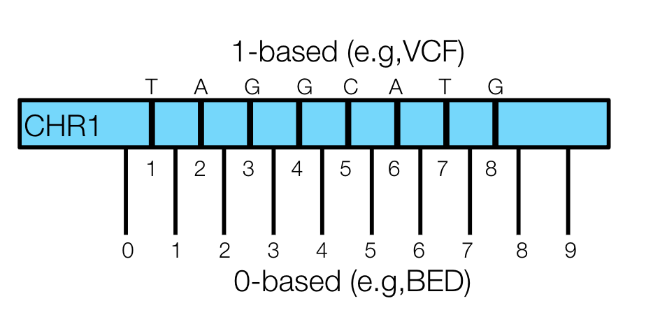

# File Preperation

## Filter VCF
```bash
nano $scripts/filter_vcf_rxy.bash
#!/bin/bash
#SBATCH --nodes=1
#SBATCH --ntasks=1
#SBATCH --mem=20GB
#SBATCH --time=12:00:00
#SBATCH --account=dut374_c
#SBATCH --job-name=filter_vcf_rxy
#SBATCH --error=/storage/home/abc6435/SzpiechLab/abc6435/KROH/job_err_output/%x.%j.out

#Set Variables
vcf_dir="/storage/home/abc6435/SzpiechLab/abc6435/KROH/data/vcf" 
work_dir="/storage/home/abc6435/SzpiechLab/abc6435/KROH/data/rxy"
bin="/storage/home/abc6435/SzpiechLab/bin"
scripts="/storage/home/abc6435/SzpiechLab/abc6435/KROH/scripts"

#filter out any missing sites
bcftools view -i 'N_MISSING<1' $vcf_dir/chKIWA_AMRE_HOWA_tags_auto_bi.vcf.gz -Oz -o $work_dir/chKIWA_AMRE_HOWA_tags_auto_bi_nmiss.vcf.gz 

bcftools annotate -x INFO,FORMAT $work_dir/chKIWA_AMRE_HOWA_tags_auto_bi_nmiss.vcf.gz -Oz -o $work_dir/chKIWA_AMRE_HOWA_tags_auto_bi_nmiss_gt.vcf.gz

#Obtain private allele sites
cd $work_dir
$bin/get_only_private_alt.py $work_dir/chKIWA_AMRE_HOWA_tags_auto_bi_nmiss_gt.vcf.gz $scripts/KIWA_IDS_e759877.txt


bgzip
nohup tabix kirtlandii_private.vcf.gz
```
🌺
## Obtain Input Files

```bash
#Set Variables
vcf="KIWA_tags_e759877_bi_qual_dp_nmiss_exhet_auto_maf.vcf.gz"
rxy="/storage/home/abc6435/SzpiechLab/bin/Rxy-kin"
data="/storage/home/abc6435/SzpiechLab/abc6435/KROH/data"
scripts="/storage/home/abc6435/SzpiechLab/abc6435/KROH/scripts"

#ID Files 
awk '{print $1, $2="A"}' OFS="\t" $scripts/cKIWA_IDS.txt > $data/pop_A.txt
awk '{print $1, $2="B"}' OFS="\t" $scripts/hKIWA_IDS.txt > $data/pop_B.txt

#Intergenic Sites
sed '1d' $data/rxy/deleterious.txt >> $data/rxy/genic_sites.bed
sed '1d' $data/rxy/tolerated.txt >> $data/rxy/genic_sites.bed
sed '1d' $data/rxy/synonymous.txt >> $data/rxy/genic_sites.bed
sed '1d' $data/rxy/nonsynonymous.txt >> $data/rxy/genic_sites.bed
sed '1d' $data/rxy/noncoding.txt >> $data/rxy/genic_sites.bed
sed '1d' $data/rxy/lossoffunction.txt >> $data/rxy/genic_sites.bed

awk '{print $1, $2-1, $2, $3}' OFS="\t" $data/rxy/genic_sites.bed > $data/rxy/temp && mv -f $data/rxy/temp $data/rxy/genic_sites.bed

zgrep ^"##contig=<ID=chr" nomissing_gt.vcf.gz | sed 's/##contig=<ID=//g' | sed 's/,.*//g' | sed '$d' > $data/rxy/chr.txt

for i in `cat $data/rxy/chr.txt`; do 
    grep -w "^${i}" $data/rxy/genic_sites.bed | sort -k3,3n  >> $data/rxy/genic_sites_sorted.bed; 
done

rm -rf $data/rxy/genic_sites.bed

awk '{print $1,$2,$3}' OFS="\t" $data/rxy/genic_sites_sorted.bed > $data/rxy/temp && mv -f $data/rxy/temp $data/rxy/genic_sites_sorted.bed

bcftools view -T ^$data/rxy/genic_sites_sorted.bed $data/rxy/nomissing_gt.vcf.gz -Oz -o $data/rxy/nomissing_gt_intergenic.vcf.gz

#Randomly Sample 2 sets of 100K intergenic sites.
bcftools view -H $data/rxy/nomissing_gt_intergenic.vcf.gz | shuf -n 100000 | cut -f1,2 > intergenic_v1.txt
for i in `cat $data/rxy/chr.txt`; do 
    grep -w "^${i}" $data/rxy/intergenic_v1.txt | sort -k2,2n  >> $data/rxy/intergenic_v1_sorted.txt;
done
rm -rf $data/rxy/intergenic_v1.txt

bcftools view -H $data/rxy/nomissing_gt_intergenic.vcf.gz | shuf -n 100000 | cut -f1,2 > intergenic_v2.txt
for i in `cat $data/rxy/chr.txt`; do 
    grep -w "^${i}" $data/rxy/intergenic_v2.txt | sort -k2,2n  >> $data/rxy/intergenic_v2_sorted.txt;
done
rm -rf $data/rxy/intergenic_v2.txt

#drop last column from mutation files
awk '{print $1,$2}' OFS="\t" $data/rxy/deleterious.txt > $data/rxy/del.txt
awk '{print $1,$2}' OFS="\t" $data/rxy/tolerated.txt > $data/rxy/tol.txt
awk '{print $1,$2}' OFS="\t" $data/rxy/lossoffunction.txt > $data/rxy/lof.txt
awk '{print $1,$2}' OFS="\t" $data/rxy/nonsynonymous.txt > $data/rxy/nonsyn.txt
awk '{print $1,$2}' OFS="\t" $data/rxy/synonymous.txt > $data/rxy/syn.txt
awk '{print $1,$2}' OFS="\t" $data/rxy/noncoding.txt > $data/rxy/noncode.txt
```
